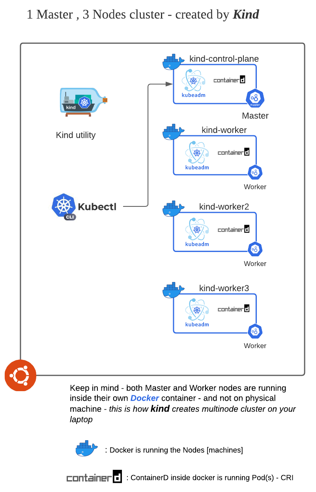

kind is a tool for running local Kubernetes clusters using Docker container “nodes”.
kind was primarily designed for testing Kubernetes itself, but may be used for local development or CI.

In this scenario we will perform these steps 

1. Install kind
2. Using kind configuration file create a cluster ( 1 master node and 3
   worker nodes )
3. Check-out the cluster - see how cluster looks like 

(Optionally) 

We will play with few of kubernetes topics :

1. Deployment with *sidecar* container (Main : NGINX , SideCar : Builds
   index.html file)
2. Expose deployment over *NodePort* - but use `externalTrafficPolicy:
   Local` to see it's impact on routing of request to pod in cluster
3. Will check IPTables entries in *kube-proxy* pod on to see what
   impact/effect `externalTrafficPolicy: Local` has on IPTables.
4. Will also how we can patch existing objects in Kubernetes

