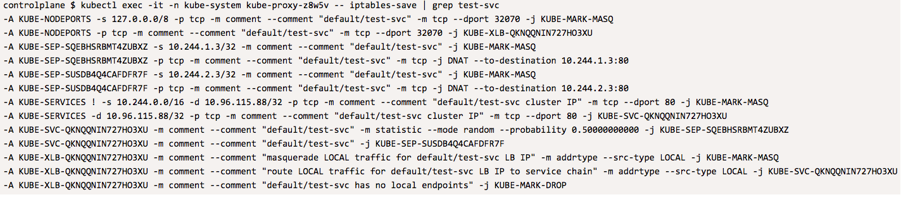

IPTables 

## Check IP-Tables on kind-worker node 

In order to see IP Tables entry in kube-proxy pod running on node kind-worker we need kube-proxy pod's name 
Let's fine that 

We know pod is running on node `kind-worker` and it has label `k8s-app=kube-proxy` attach to it - with that tow info we 
should be able to get POD name 

`KUBEPROXY_POD_ON_WORKER_NODE=$(kubectl get pods -n kube-system \
--field-selector=spec.nodeName=kind-worker -l k8s-app=kube-proxy -o name \
--no-headers)`{{execute}}

Now using that POD name execute command inside the container and grep for iptables entry to Service `test-svc` 

`echo "Getting iptables related to defalut/test-svc on kind-worker node"
kubectl exec -it -n kube-system $KUBEPROXY_POD_ON_WORKER_NODE -- iptables-save | grep test-svc
`{{execute}}

Sample output: 

From above output you can see that on kind-worker node for service test-svc (in namespace default) there are no local end-points 

`
-A KUBE-XLB-QKNQQNIN727HO3XU -m comment --comment "default/test-svc has no local endpoints" -j KUBE-MARK-DROP
`

