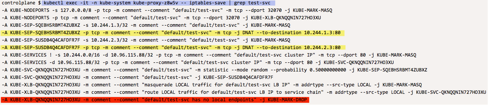

IPTables 

## Check IP-Tables on kind-worker node 

NodePort uses IPTables created on kube-proxy on each port to do NAT transformation to route/load balance Service traffic  
That means each Node on cluster has IPTables entries about each service that know what are the possible end-points it can rout traffic to.

In order to see IP Tables entry in ***kube-proxy*** pod running on node *kind-worker* we need kube-proxy pod's name 
Let's find that 

We know pod is running on node `kind-worker` and it has label `k8s-app=kube-proxy` attach to it - with that two piece of information we 
should be able to get POD name using *kubectl*.

`KUBEPROXY_POD_ON_WORKER_NODE=$(kubectl get pods -n kube-system \
--field-selector=spec.nodeName=kind-worker -l k8s-app=kube-proxy -o name \
--no-headers)`{{execute}}

Will store output in `KUBEPROXY_POD_ON_WORKER_NODE` for future use

Now using that POD name execute command inside the container and grep for iptables entry to Service `test-svc` 

`echo "Getting iptables related to defalut/test-svc on kind-worker node"
kubectl exec -it -n kube-system $KUBEPROXY_POD_ON_WORKER_NODE -- iptables-save | grep test-svc
`{{execute}}

Sample output: 

From above output you can see that on `kind-worker` node we do have end-points/IP address registered for PODs running on other two nodes  
In above sample-output IP address *10.244.1.3* and *10.244.2.3* are IP address of PODs running on other two nodes - so if needed to Service 
can rout traffic to one of those pods even no local Pods are running on that Node.

But at same time it has entry stating for service **test-svc** (in namespace default) there are no local end-points - and we have configured 
`test-svc` service with `externalTrafficPolicy: Local`

`
-A KUBE-XLB-QKNQQNIN727HO3XU -m comment --comment "default/test-svc has no local endpoints" -j KUBE-MARK-DROP
`

