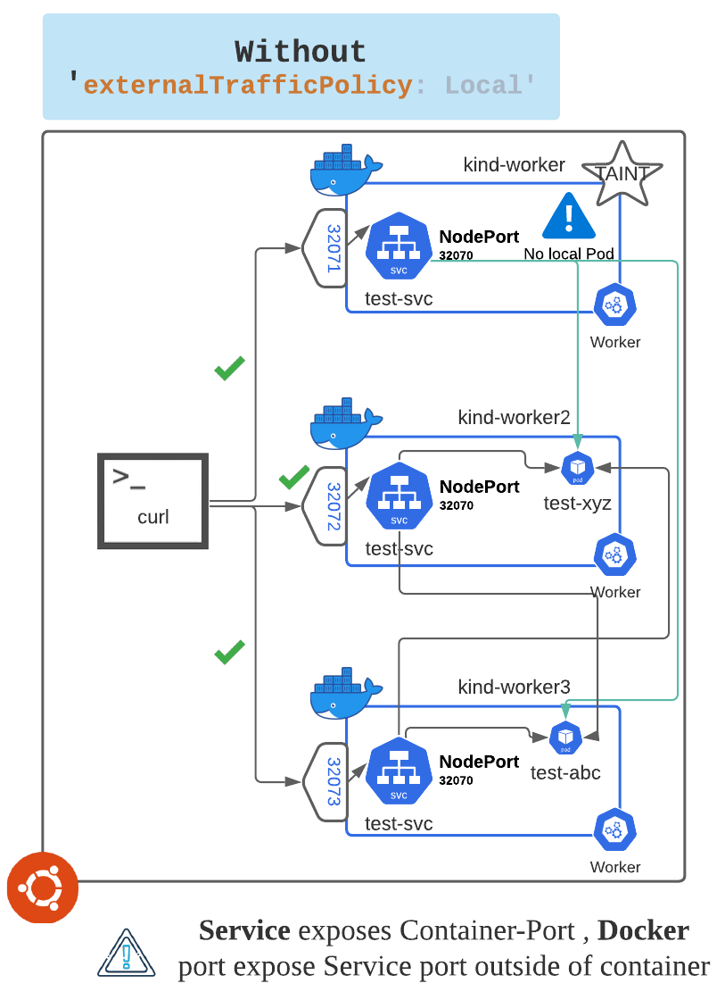

Update service

## Remove `externalTrafficPolicy` from service `test-svc`

We can update `test-svc` in-place using *kubectl* **path** command 

`kubectl patch svc test-svc --type json -p='[{"op":"remove","path":"/spec/externalTrafficPolicy"}]'`{{execute}}

Now if you run describe on service - test-svc you should see that External Traffic Policy is set to `Cluster` (dealt value) 

```
master $ kubectl describe service test-svc | grep -i policy
External Traffic Policy:  Cluster
```

## Test again 

Now if you hit the end-point on Node `kind-worker` than it should reply (previously it was failing)

`curl --max-time 4 http://0.0.0.0:32071`{{execute}}

The output will look something like this - you can see even thou we hit node `kind-worker` the reply 
came from POD running on `kind-worker3` 

`
master $ curl --max-time 4 http://0.0.0.0:32071
Reply from POD: [test-6d9c9d5b86-xddmw] running on Node: [kind-worker3]
`

## Updated NodePort service routs

Now the routing for NodePort looks like this :

You can hit any Node in cluster for `test-svc` service and it will rout you to one of the two available PODs.

