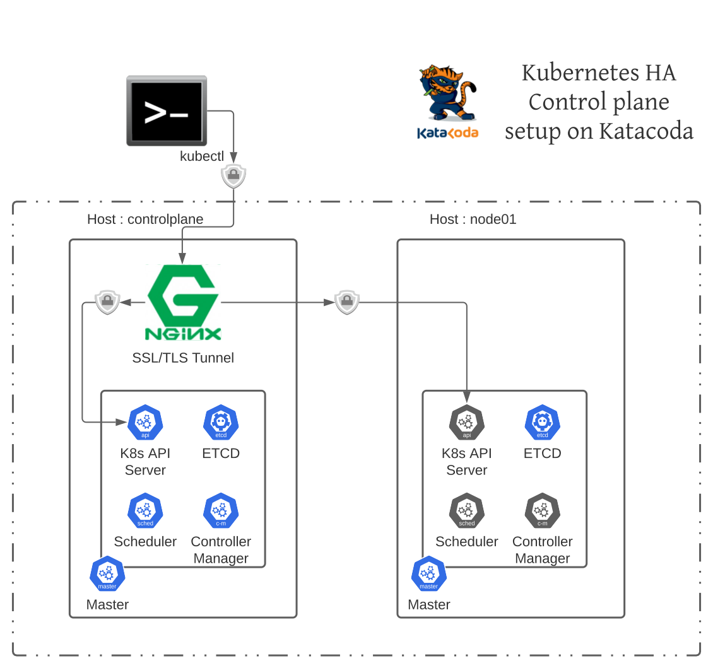

 In this scenario we will see how we can create HA Control plane (masters) nodes in Kubernetes 

At the end of this scenario we will have two Master nodes running on two different machines fronted ended 
by single NGINX load balancer . We should be able to use single API Server URL that we can use 
in kubeconfig . We will test out the fail our as well in action . 

High-level steps that we will perform in this scenario are :

1. Install NGINX , enable TLS tunneling (so to end TLS traffic at API server and not at NGINX)
1. Will add two Host(s) and Ports to NGINX load balancer config so it can load balancer among two Master(s)
1. Install first master in control plane (will use NGINX hostname and port as API server endpoint)
1. Install second master 
1. Using kubectl tool check out the we are seeing two masters 
1. Create few Pods 
1. Try out fail-over and see HA is indeed working  

At he end our setup should look like this : 

