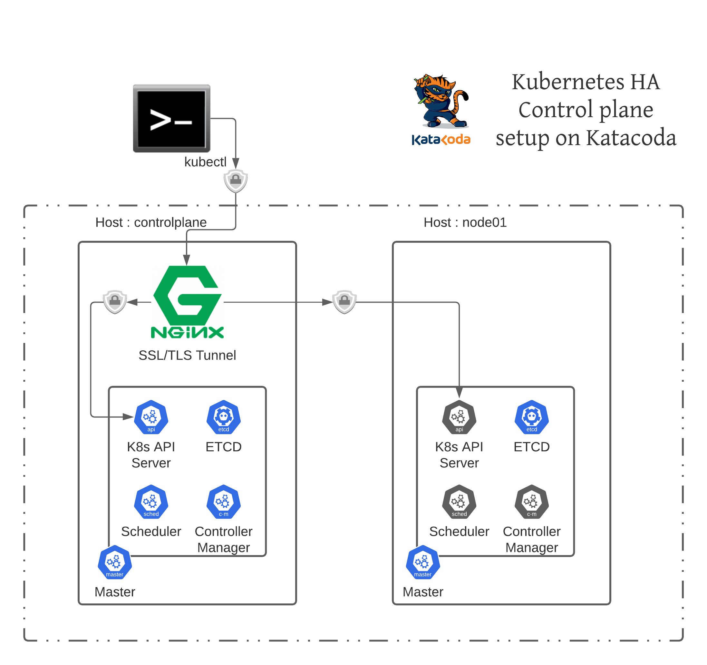
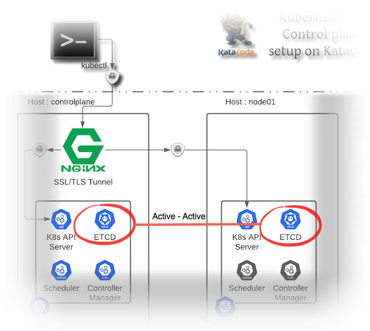
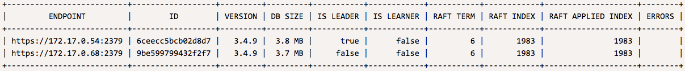
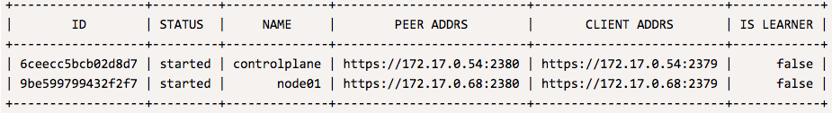

Inspect HA Setup 

# Who is the leader (in scheduler)

As we see from below diagram only one of scheduler can be active at a time - and that esentailly decides 
who is leader in this HA setup 




In order to find out who is leader we can run below kubectl command 

`
kubectl get endpoints kube-scheduler -n kube-system -o jsonpath="{.metadata.annotations.control-plane\.alpha\.kubernetes\.io/leader}" | jq .
`{{execute}}

Out might look like this - the field holderIdentity tells us which master is **leader** 
in below case it is 'controlplane'

```
{
  "holderIdentity": "controlplane_737f8152-4247-49d4-b3c9-c279dc32fff8",
  "leaseDurationSeconds": 15,
  "acquireTime": "2020-10-03T09:19:00Z",
  "renewTime": "2020-10-03T09:20:31Z",
  "leaderTransitions": 0
}
```

# Who is the leader (in ETCD)

As seen below ETCD component in HA setup is always active-active in all master nodes  

 

Let see if we can use `etcdctl` tool to list current member of ETCD cluster and see who 
is leader 

`CACERT=$(cat /etc/kubernetes/manifests/etcd.yaml | grep peer-trusted-ca-file | cut -d= -f2)
SERVER_KEY=$(cat /etc/kubernetes/manifests/etcd.yaml | grep peer-key-file | cut -d= -f2)
SERVER_CERT=$(cat /etc/kubernetes/manifests/etcd.yaml | grep peer-cert-file | cut -d= -f2)
ENDPOINTS=$(cat /etc/kubernetes/manifests/etcd.yaml | grep advertise-client-urls= | cut -d= -f2)
ETCDCTL_API=3 etcdctl --endpoints $ENDPOINTS --write-out=table --cacert $CACERT --cert $SERVER_CERT --key $SERVER_KEY \
    endpoint --cluster status
`{{execute}}

You will see output like this :

 

If you need to know exact member (names) you can use this command 

`
ETCDCTL_API=3 etcdctl --endpoints $ENDPOINTS --write-out=table --cacert $CACERT --cert $SERVER_CERT --key $SERVER_KEY \
   member list
`{{execute}}

Output will look like this : 



From above tow table we can see that `controlplane` is leader - but the problem is RAFT consensus has not yet reached as we only have **two** ETCD members. 
This is because ETCD clusters are based on [raft](http://thesecretlivesofdata.com/raft/) consensus - and it needs [odd number](https://etcd.io/docs/v3.2.17/faq/) of members to reach consensus (elect leader)

For now we are okay but with this setting we can't go in production - in this case it is better to have
**one** master node instead of **two** !!

# Is ETCD keeping copy of data on both instances

Lets check if both ETCD members running on two servers are writing/saving cluster data as expected
Way we check is we look for data that we know needs to be there in ETCD key/value DB

If you run below commands you will see that on 'controlplane' server we do see our deployment named
`hatest` is there in ETCD DB. Run below commands to check that out

`
echo "Dump ETCD keyvalue(s) to json file"
ETCDCTL_API=3 etcdctl --endpoints $ENDPOINTS --write-out=table --cacert $CACERT --cert $SERVER_CERT --key $SERVER_KEY get "" --prefix=true -w json> etcd-dump.json
echo "Search for string hatest in JSON file"
for i in $(cat etcd-dump.json | jq ".kvs[] | .key" -r); do echo $i | base64 -d;echo ""; done | grep -m 5 hatest
`{{execute}}

Now, If you run same commands on 'node01' server we will see ETCD running on this machine also has 
same data duplicated 

`
echo "Dump ETCD keyvalue(s) to json file"
ssh node01 ETCDCTL_API=3 etcdctl --endpoints $ENDPOINTS --write-out=table --cacert $CACERT --cert $SERVER_CERT --key $SERVER_KEY get "" --prefix=true -w json> etcd-dump-node01.json
`{{execute}}

Above command will execute etcdctl command on remote machine `node0` and capture output of that command in `etcd-dump-node01.json`

`
echo "Now Search for string hatest in JSON file from node01 etcd"
for i in $(cat etcd-dump-node01.json | jq ".kvs[] | .key" -r); do echo $i | base64 -d;echo ""; done | grep -m 5 hatest
`{{execute}}

So this tells us that ETCD data is getting replicated on both ETCD members as expected.


