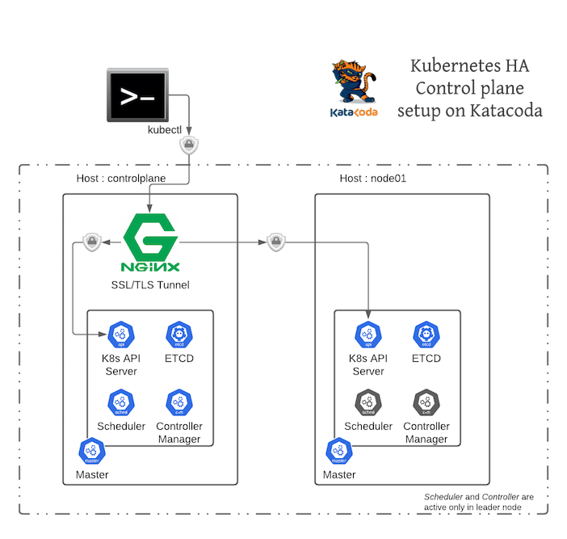

Inspect HA Setup 

# Who is leader

As we see from below diagram only one of scheduler can be active at a time - and that esentailly decides 
who is leader in this HA setup 



In order to find out who is leader we can run below kubectl command 

`
kubectl get endpoints kube-scheduler -n kube-system -o jsonpath="{.metadata.annotations.control-plane\.alpha\.kubernetes\.io/leader}" | jq .
`{{execute}}

Out might look like this - the field holderIdentity tells us which master is **leader** 
in below case it is 'node01'

```
{
  "holderIdentity": "node01_9514ebe4-b85f-45e5-a8d2-4152e6abb812",
  "leaseDurationSeconds": 15,
  "acquireTime": "2020-10-03T07:49:57Z",
  "renewTime": "2020-10-03T08:22:39Z",
  "leaderTransitions": 2
}
```