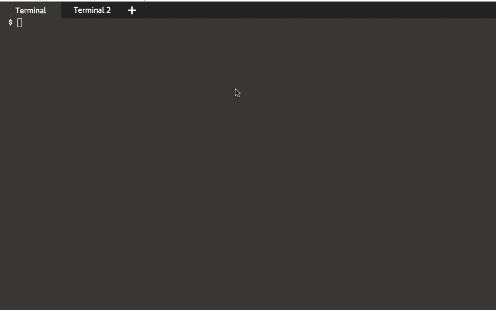

# Advance things 

## Change application behaviour 

As you can see from python application's code that it uses environment variable called `HTTP_PORT` to decide what port to start server on 

```python
if __name__ == "__main__":
    httpPort = 8080
    if 'HTTP_PORT' in os.environ:
        try:
            httpPort = int(os.environ['HTTP_PORT'])
        except ValueError:
            print("****** Failed to parse environment variable [HTTP_PORT], will use default port 8080")

    print("Starting server on Port: " + str(httpPort))
    app.run(host='0.0.0.0', port=httpPort)
```
We can see that during docker build we declared this environment variable 

```DOCKERFILE
# Declare environment variable HTTP_PORT
ENV HTTP_PORT=8080
```
And during inspecting the applicaion we can see same variable is present there as well 

```bash
$ 
[
  "PATH=/usr/local/bin:/usr/local/sbin:/usr/local/bin:/usr/sbin:/usr/bin:/sbin:/bin",
  "LANG=C.UTF-8",
  "GPG_KEY=0D96DF4D4110E5C43FBFB17F2D347EA6AA65421D",
  "PYTHON_VERSION=3.6.13",
  "PYTHON_PIP_VERSION=21.1.2",
  "PYTHON_GET_PIP_URL=https://github.com/pypa/get-pip/raw/936e08ce004d0b2fae8952c50f7ccce1bc578ce5/public/get-pip.py",
  "PYTHON_GET_PIP_SHA256=8890955d56a8262348470a76dc432825f61a84a54e2985a86cd520f656a6e220",
  "HTTP_PORT=8080"
]
```

`docker inspect my-py-flask:1.0.0 | jq .[0].ContainerConfig.Env`{{execute}}

Now during container start we can change the variable via command 

`docker run -d -p 8787:8989 --rm --env HTTP_PORT=8989 --name my-py-flask-app my-py-flask:1.0.0`{{execute}}

Few things to observe in above command 

1. `--rm`
1. `-p 8787:8989`
1. `--env HTTP_PORT=8989`

Hit the URL again - URL for outside world stays the same

`curl http://localhost:8787/visits-counter/`{{execute}}

## Docker logs 

We can see that python app prints a line 

```bash
    print("Starting server on Port: " + str(httpPort))
```    
So for above container if we look like logs for container we should see value `8989` getting printed 

`docker logs my-py-flask-app`{{execute}}

```bash
$ docker logs my-py-flask-app 
Starting server on Port: 8989
 * Serving Flask app 'app' (lazy loading)
 * Environment: production
   WARNING: This is a development server. Do not use it in a production deployment.
   Use a production WSGI server instead.
 * Debug mode: off
 * Running on all addresses.
   WARNING: This is a development server. Do not use it in a production deployment.
 * Running on http://172.18.0.2:8989/ (Press CTRL+C to quit)
172.18.0.1 - - [14/Jun/2021 22:35:09] "GET /visits-counter/ HTTP/1.1" 200 -
```
As you can see it did print value `8989` in output 

### Tail the log 

You can tail the log like this 

`docker logs my-py-flask-app -f`{{execute}}



Stop tailing the log `clear`{{execute interrupt}}

### Stop container 

`docker stop my-py-flask-app`{{execute}}

## Mount volume 

We can see that python app in container is at location `/opt/app.py`

`docker exec my-py-flask-app ls -la /opt`{{execute}}

How about we want to mount our local file `/root/py-flask/app.py` in place of that ? 

Let's first edit `/root/py-flask/app.py` and change replay to have `TIBCO` (in capital) 

now you can run new docker `RUN` command like this 

`docker run -d -p 8787:8989 --rm --env HTTP_PORT=8989 -v /root/py-flask:/opt --name my-py-flask-app my-py-flask:1.0.0`{{execute}}

Switch `-v /root/py-flask:/opt` did the trick - it mounts local directory `/root/py-flask` inside the container `/opt` 

If you hit the service again : `curl http://localhost:8787/visits-counter/`{{execute}}

```bash
$ curl http://localhost:8787/visits-counter/
Hello from TIBCO Server [14b3c94899be] Total visitors on this server : 1$ 
```

## What happens if Python server stops ? 

Use command `curl http://localhost:8787/shutdown`{{execute}} to stop Flask server 

Check if container is running ? 

`docker ps`{{execute}}

What happens if this happens in production ? 

