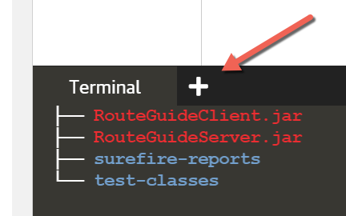
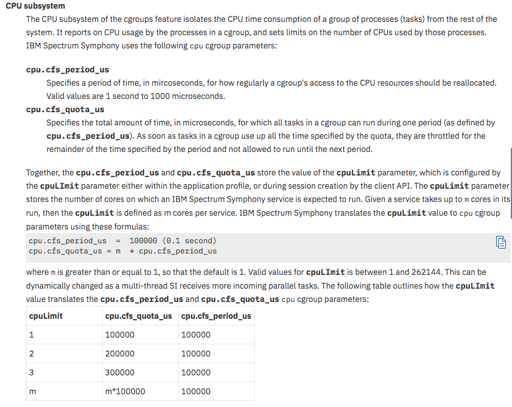

# Namespace and cgroup - playing around 

First let's find out hostname of current machine 

`hostname`{{execute}}  
`hostname -I`{{execute}}

Make note of above two outputs

Now create a simple `ubuntu` container that sleeps for 3600 seconds

`docker run --rm -h nstest-host -d --name nstest ubuntu sleep 3600`{{execute}}

Get PID of container (in turn PID of sleep command)
`PID=$(docker inspect --format {{.State.Pid}} nstest)`{{execute}}

This command demonstrates how `docker exec` works 

`nsenter --target $PID --mount --uts --ipc --net --pid`{{execute}}

**nsenter** == `nsenter - run program with namespaces of other processes`

Above command will put you inside the container just as `docker exec` would have done
Now let's check `hostname` and `IP Address` of this container 

`hostname`{{execute}}  
`hostname -I`{{execute}}

Sample output 
```
-bash: warning: setlocale: LC_ALL: cannot change locale (en_US.UTF-8)
root@nstest-host:/# hostname
nstest-host
root@nstest-host:/# hostname -I
172.18.0.2
```
let's do clean up 

`exit`{{execute}}  
`docker stop nstest -t 1`{{execute}}

## Memory test

`docker run --rm -d --memory=512m --name memtest ubuntu sleep 3600`{{execute}}

`docker exec -it memtest /bin/bash`{{execute}}

`free -mt`{{execute}}

Open new terminal and run this command 



`docker events`

Back to main terminal run below command it will not run - it will get killed with OOM as it exceeds limits 
First we install `stress` tool  

`apt-get update && apt-get install -y stress`{{execute}}

Now we put stress  
`stress --cpu 2 --io 4 --vm 4 --vm-bytes 1024M --timeout 60s`{{execute}}

You will see above command will get killed with message like this :  
```
stress: info: [415] dispatching hogs: 2 cpu, 4 io, 4 vm, 0 hdd
stress: FAIL: [415] (415) <-- worker 425 got signal 9
stress: WARN: [415] (417) now reaping child worker processes
stress: FAIL: [415] (451) failed run completed in 5s
```

In our `docker events` terminal we will see `OOM` message - as it tried to allocate more memory than it is allowed

Sample output  
```BASH
controlplane $ docker events
2021-03-04T18:53:35.582647009Z container oom 969854edebcfbb29df2aa44b8ac416b6b265c5d35f655927a8bc84f4dd95ce14 (image=ubuntu, name=nstest)
```

This should work 
`stress --cpu 2 --io 4 --vm 4 --vm-bytes 104M --timeout 10s`{{execute}}

We are done clean up 

Exit out of container 
`exit`{{execute}}

Stop container 
`docker stop memtest -t 1`{{execute}}

## CPU Test 

First we run container ***without*** any CPU limits 

`docker run --rm -d --name cputest ubuntu sleep 3600`{{execute}}

`docker exec -it cputest /bin/bash`{{execute}}

`apt-get update && apt-get install -y stress`{{execute}}

`stress --cpu 2 --timeout 60`{{execute}}

Open new terminal 

Run command `top`{{execute}} - you will see that `stress` is hogging all **100% CPU** available to this host.

```
top - 22:42:58 up  7:33,  2 users,  load average: 0.22, 0.60, 0.47
Tasks: 103 total,   3 running,  57 sleeping,   0 stopped,   0 zombie
%Cpu(s): 99.8 us,  0.0 sy,  0.0 ni,  0.0 id,  0.0 wa,  0.0 hi,  0.0 si,  0.2 st
KiB Mem :  1524584 total,   919084 free,   180020 used,   425480 buff/cache
KiB Swap:  1003516 total,  1003000 free,      516 used.  1205788 avail Mem 

  PID USER      PR  NI    VIRT    RES    SHR S  %CPU %MEM     TIME+ COMMAND                         
14199 root      20   0    3860    100      0 R  99.7  0.0   0:07.67 stress                          
14200 root      20   0    3860    100      0 R  99.7  0.0   0:07.66 stress     
```
Back in main terminal - do cleanup 

`exit`{{execute}}  
`docker stop cputest -t 1`{{execute}}

Now we run it with CPU limites 

Flag `--cpus` allowes docker to put cpu limit on container - in this case it cannot use more than 1 cpu 

`docker run --rm -d --cpus="1" --name cputest ubuntu sleep 3600`{{execute}}

log-in to container and run stress test 

`docker exec -it cputest /bin/bash`{{execute}}

`apt-get update && apt-get install stress`{{execute}}

`stress --cpu 2 --timeout 60`{{execute}}

Open new terminal 

Now if you do `top`{{execute}} than you will see `stress` is not able to take more than 1 cpu , the host has 2 cpus 
so 50% CPU used means 1 cpu is busy/in-use 

```
top - 18:43:11 up 38 min,  2 users,  load average: 0.36, 0.47, 0.27
Tasks: 106 total,   3 running,  58 sleeping,   0 stopped,   2 zombie
%Cpu(s): 49.8 us,  0.0 sy,  0.0 ni, 49.7 id,  0.0 wa,  0.0 hi,  0.0 si,  0.5 st
KiB Mem :  2040680 total,   520624 free,   220740 used,  1299316 buff/cache
KiB Swap:        0 total,        0 free,        0 used.  1676628 avail Mem 

  PID USER      PR  NI    VIRT    RES    SHR S  %CPU %MEM     TIME+ COMMAND                         
12808 root      20   0    3860    100      0 R  50.3  0.0   0:02.78 stress                          
12807 root      20   0    3860    100      0 R  49.7  0.0   0:02.75 stress                          
    1 root      20   0  159904   9080   6680 S   0.0  0.4   0:03.41 systemd       
```
Back in main terminal - do cleanup 

`exit`{{execute}}

`docker stop cputest -t 1`{{execute}}

## Create your own cgroup 

Install control groups utility

`apt-get update && apt-get install cgroup-bin tree -y`{{execute}}

Let say we want to create create cgroup that limits process to one(1) CPU . We are not setting cpu affinity we are setting
out of all avalable compute capacity on host how much process can use.

let's call our `cgroup` - `mycputest` - below command will create that

`sudo cgcreate -a $USER -g cpu:mycputest`{{execute}}

These creates bunch of files under `/sys/fs/cgroup/cpu/mycputest` (`tree /sys/fs/cgroup/cpu/mycputest`{{execute}} ) 

For now we care about below two files 

`cat /sys/fs/cgroup/cpu/mycputest/cpu.cfs_quota_us`{{execute}}  
`cat /sys/fs/cgroup/cpu/mycputest/cpu.cfs_quota_us`{{execute}}

In order to set it to use **1 cpu** we set both the values to `100000`

`cgset -r cpu.cfs_quota_us=100000 mycputest`{{execute}}  
`cgset -r cpu.cfs_period_us=100000 mycputest`{{execute}}

On this machine we have 2 cpus ( you can use command `lscpu`{{execute}} to find that out)
Our new cgroup will limit any application using that cgroup to use only 1 cpu capacity out of that.

```
$ lscpu
Architecture:        x86_64
CPU op-mode(s):      32-bit, 64-bit
Byte Order:          Little Endian
CPU(s):              2
```
Let's test that 

First let's install stress tool on host machine 

`apt-get update && apt-get install stress`{{execute}}

Open **new** terminal - run `top`{{execute}} command

Back in main terminal run command - if `cgroup` is working as expected than our stress program should not be taking
more than 50% of CPU   

`cgexec -g cpu:mycputest stress --cpu 2 --timeout 60`{{execute}}

We should see that `stress` tool is not taking more than one CPU 

Sample output 

```
top - 21:26:19 up 37 min,  2 users,  load average: 0.14, 0.16, 0.07
Tasks: 102 total,   3 running,  55 sleeping,   0 stopped,   0 zombie
%Cpu(s): 50.1 us,  0.0 sy,  0.0 ni, 49.9 id,  0.0 wa,  0.0 hi,  0.0 si,  0.0 st
KiB Mem :  1524584 total,   568064 free,   149576 used,   806944 buff/cache
KiB Swap:  1003516 total,  1003516 free,        0 used.  1225516 avail Mem 

  PID USER      PR  NI    VIRT    RES    SHR S  %CPU %MEM     TIME+ COMMAND                         
21977 root      20   0    8248     96      0 R  49.8  0.0   0:03.88 stress                          
21978 root      20   0    8248     96      0 R  49.8  0.0   0:03.83 stress  
```

<details>
  <summary>Click to read more about cfs_period_us & cfs_quota_us </summary>

[Link](https://www.ibm.com/support/knowledgecenter/en/SSZUMP_7.1.2/management_sym/cgroup_subsystems.html)  
  


</details>


# Inspect `cgroup` created by docker 

Now we know what happens when docker want's to control cpu for container - it creates `cgroup` for that container - let see that in action 

Create a container with CPU limits 

`docker run --rm -d --cpus="1" --name cgutest ubuntu sleep 3600`{{execute}}

get PID of this `sleep` command inside container 

`PID=$(docker inspect --format {{.State.Pid}} cgutest)`{{execute}}

All the `cgroup` created by docker for this container can be founder in file `/proc/$PID/cgroup`

`cat /proc/$PID/cgroup`{{execute}}

We can get cgroup info that we need using below two helper bash commands 

`one_of_cgroup=$(head -n 1 /proc/$PID/cgroup)`{{execute}}  
`cgroup_subpath=$(cut -d\: -f3 <<< "$one_of_cgroup")`{{execute}}

Now we have subpath that we can use to get cgroup file for `cpu` created by docker

`tree /sys/fs/cgroup/cpu/$cgroup_subpath`{{execute}}

Now we know if we set cpu limit to 1 than file `cpu.cfs_quota_us` and `cpu.cfs_quota_us` will have value of ? 

`cat /sys/fs/cgroup/cpu/$cgroup_subpath/cpu.cfs_quota_us`{{execute}}  
`cat /sys/fs/cgroup/cpu/$cgroup_subpath/cpu.cfs_quota_us`{{execute}}

**Yes** it will be `100000` 