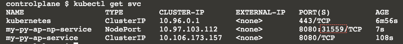

## Expose Deployment endpoint over ClusterIP 

Below command will expose deployment `my-py-ap` (port 8080) as Cluster Service on Fixed (Cluster allocated IP) IP and port 8080

`kubectl expose deployment my-py-ap --name=my-py-ap-service --target-port=8080 --port=8080`{{execute}}

List service 

`kubectl get svc`{{execute}}

Sample output : 

```bash
controlplane $ kubectl get svc
NAME               TYPE        CLUSTER-IP       EXTERNAL-IP   PORT(S)    AGE
kubernetes         ClusterIP   10.96.0.1        <none>        443/TCP    5m14s
my-py-ap-service   ClusterIP   10.106.173.157   <none>        8080/TCP   6s
```

We can access above service only within cluster - let's create one temporory pod and try running `curl` there to see if we can access end-point  
from there , no need to access it via IP - we can use service ane `my-py-ap-service` 

`kubectl run tester --rm=true --image=curlimages/curl --restart=Never -it -- curl http://my-py-ap-service:8080/visits-counter/`{{execute}}

Sample output 

```bash
kubectl run tester --rm=true --image=curlimages/curl --restart=Never -it -- curl http://my-py-ap-service:8080/visits-counter/
Hello from Server [my-py-ap-77c79c4cfd-wdgtn] Total visitors on this server : 1pod "tester" deleted
```

## Expose it over Node Port 

With below command we expose deployment's port 8080 now outside cluster - kubernetes will allocated TCP port in between range (30000-32767) .

`kubectl expose deployment my-py-ap --name=my-py-ap-np-service --target-port=8080 --port=8080  --type=NodePort`{{execute}}

List service 

`kubectl get svc`{{execute}}

Sample output 



Now using TCP port e.g `3XXXXX` (in above case it is `31559`)  we can access end-point directly from our host machine 

`curl http://localhost:3XXXXX/visits-counter/`{{execute}}

Sample output : 

```bash
controlplane $ curl http://localhost:31559/visits-counter/
Hello from Server [my-py-ap-77c79c4cfd-wdgtn] Total visitors on this server : 1controlplane $
```

## Random load balance in action 

If you run `curl` repeatedly you will see reply is coming back from different pods/machines 

