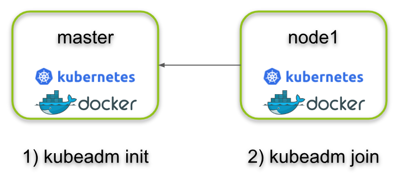

## kubelet ? 

`systemctl --no-pager | grep kubelet`{{execute}}

`systemctl status kubelet`{{execute}}

## Create cluster using kubeadm

[kubeadm](https://kubernetes.io/docs/reference/setup-tools/kubeadm/) - Documentation 

We will create a single master/node kubernetes cluster using kubeadm (version: 1.19)

`kubeadm init --pod-network-cidr=10.244.0.0/16`{{execute}}

Once above command succeeds we got ourselves working cluster 

Lets setup kubeconfig so we can run kubectl and interact with cluster 
`
mkdir -p $HOME/.kube
sudo cp -i /etc/kubernetes/admin.conf $HOME/.kube/config
sudo chown $(id -u):$(id -g) $HOME/.kube/config
`{{execute}}

## Install network 

As of now cluster is not ready (master node) - because it is waiting network (CNI) to be add to cluster
Lets installed [Canal](https://docs.projectcalico.org/getting-started/kubernetes/flannel/flannel) CNI to cluster 

`
curl https://docs.projectcalico.org/manifests/canal.yaml -O
kubectl apply -f canal.yaml
`{{execute}}

## Wait for CANAL network to be installed 

`
EXPECTED_PODS=9
while true;
  do CHECK=$(kubectl get pods -n kube-system --field-selector status.phase=Running --no-headers | wc -l);
   if [ $CHECK -eq $EXPECTED_PODS ];
     then 
          echo "ALL PODs are up";
          kubectl get pods -n kube-system --field-selector status.phase=Running
          break;
     else 
          echo "All PODs are not yet up";
          echo "Expected $EXPECTED_PODS Pods in kube-system namespace to be running found [$CHECK] running"
   fi;
   sleep 5;
done`{{execute}}

### Kubelet ? 

`systemctl status kubelet`{{execute}}

## Over view 

What are main use of kubeadm ?

