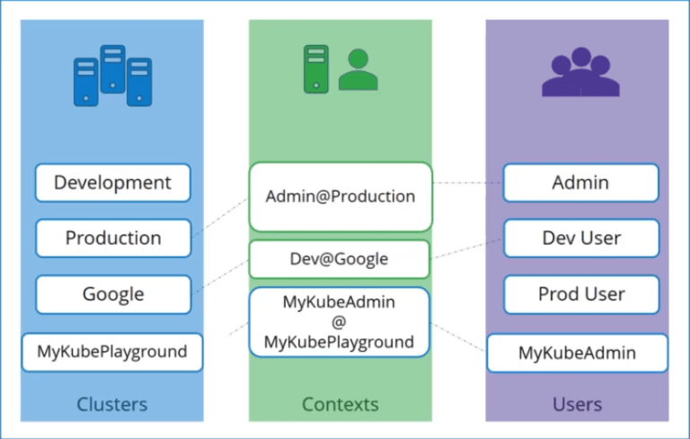
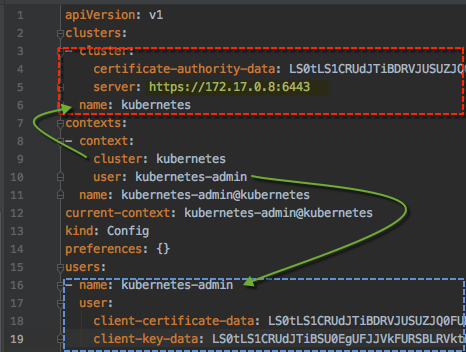

## Kube config 

The kubeconfig file is in a specific format. Let’s take a look at that. The config file has 3 sections.

1. Clusters
1. Users
1. Contexts

Clusters
Clusters are the various Kubernetes clusters that you need access to. Say you have multiple clusters for development environment or   
testing environment or prod or for different organizations or on different cloud providers etc. All those go their.

Users
Users are the user accounts with which you have access to these clusters. For example the admin user, a dev user, a prod user etc. These   
users may have different privileges on different clusters.

Contexts
Finally contexts marry these together context define which user account will be used to access which cluster.

## View Config 

You can view your config file using command 

`cat ~/.kube/config`{{execute}}

