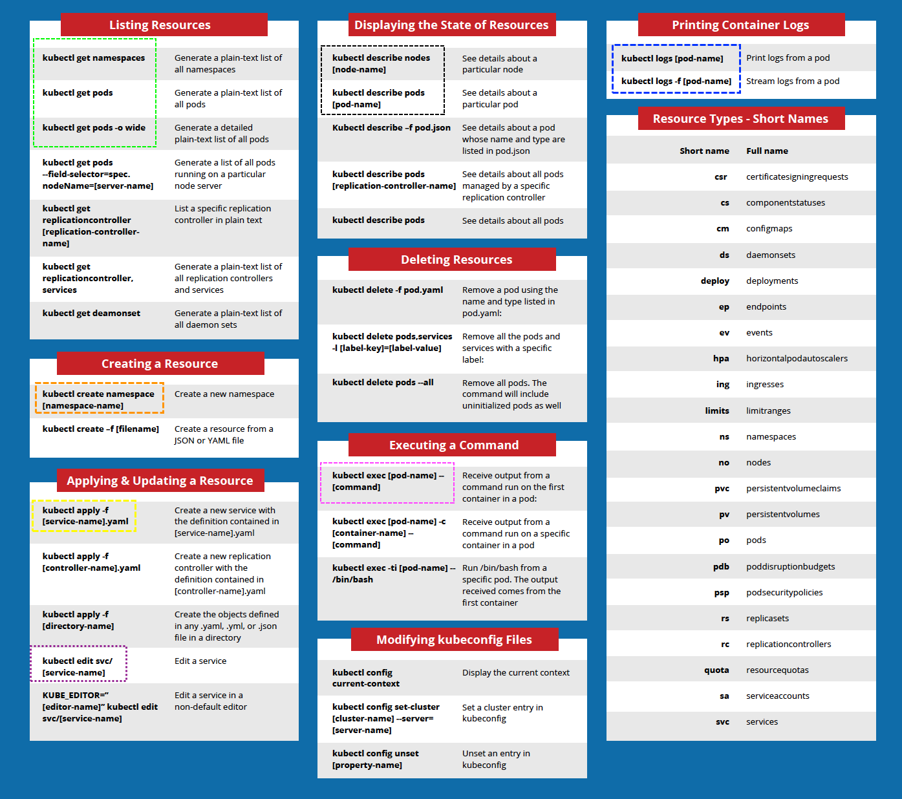

## Most used commands 

## Install etcdctl tool 

`etcdctl` is command line tool to manage etcd server and it’s date.
We will use this tool to back and restore etcd data

`kubectl create deployment my-py-ap --image=ishswar/webpyapp:1.0.1 --port=8080`{{execute}}

`kubectl get deployments.apps my-py-ap`{{execute}}

`kubectl get pods`{{execute}}

`kubectl describe nodes controlplane | grep Taint`{{execute}}

`kubectl taint node controlplane node-role.kubernetes.io/master:NoSchedule-`{{execute}}

`kubectl get pods`{{execute}}

#